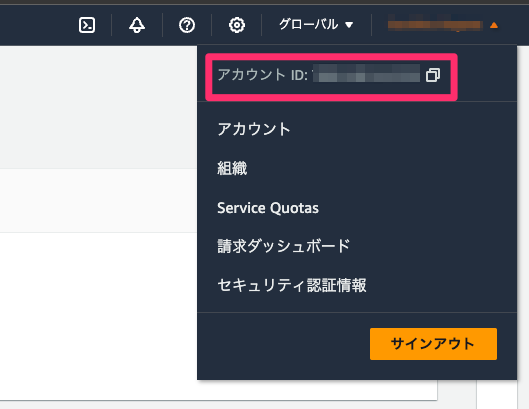
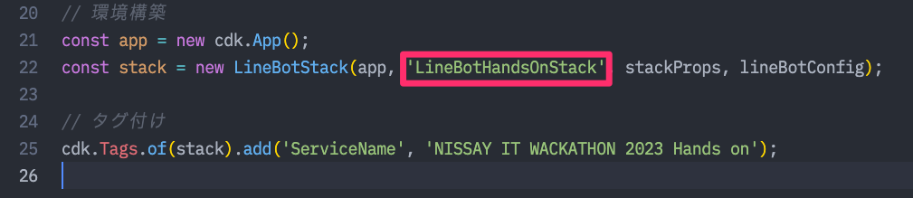
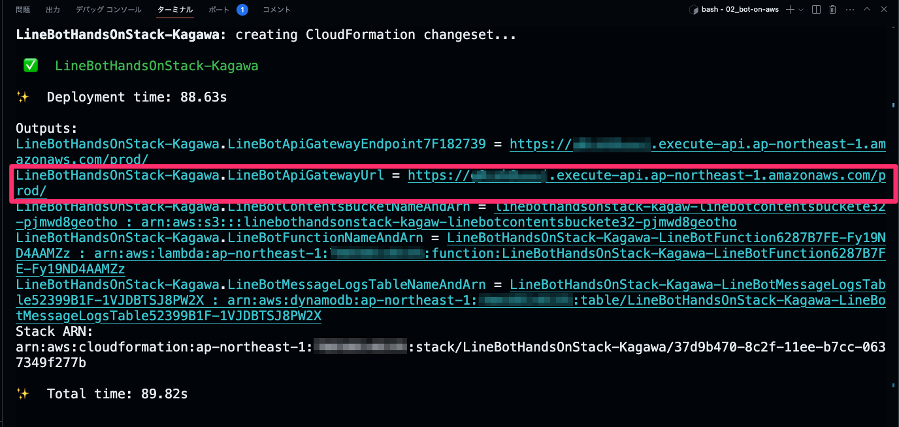
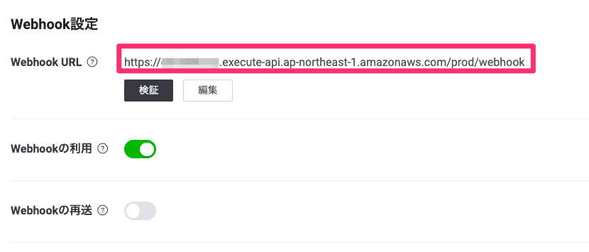
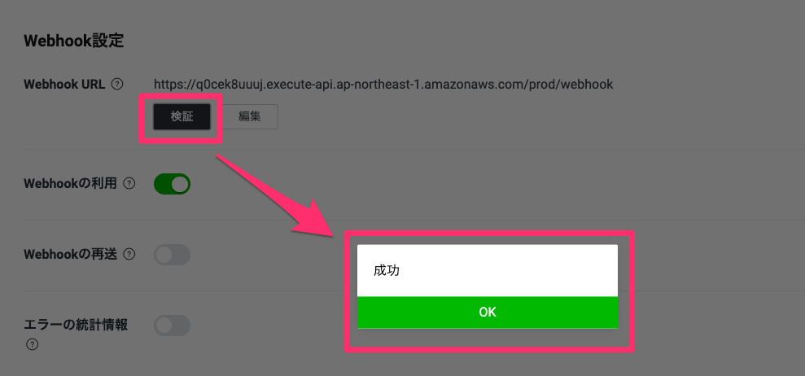
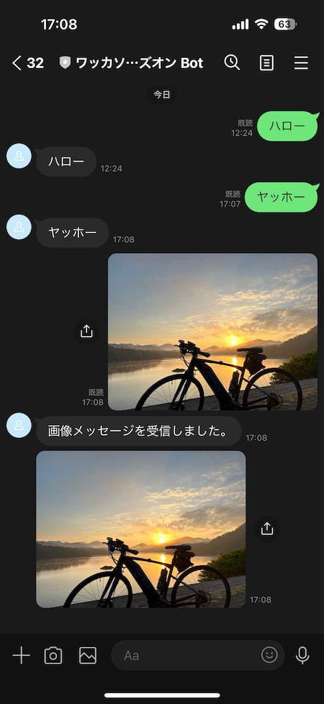
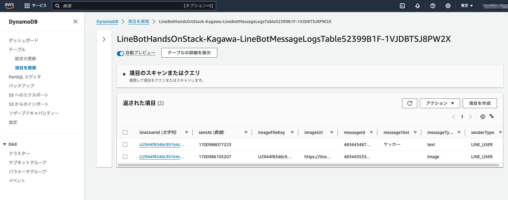
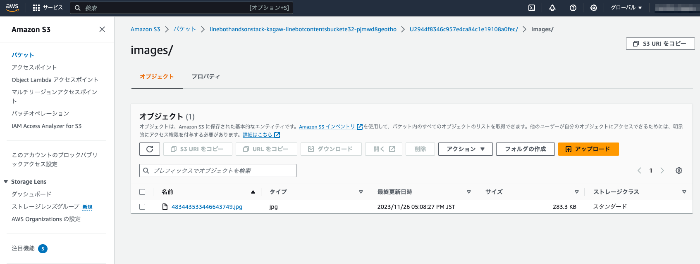
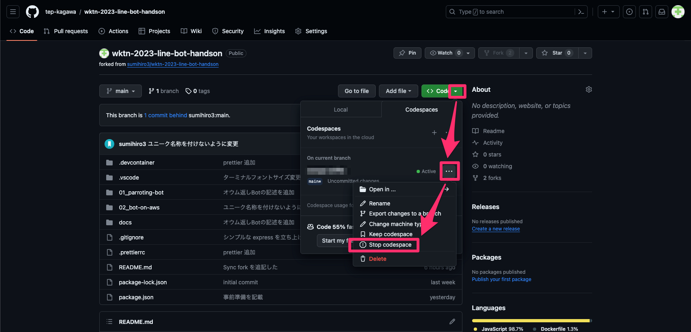
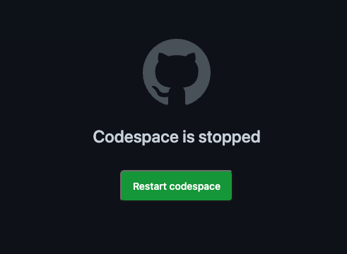

# Bot を AWS で稼働させる

## 1. 今回のハンズオンで利用する主な AWS サービス

| サービス | 概要 | 本 Bot で利用する内容 |
| ---- | ---- | ---- |
| AWS Lambda | Runtime | Bot アプリケーションの実行環境 (Node.js v18) |
| Amazon DynamoDB | NoSQL Database | Bot での会話記録の保存 |
| Amazon Simple Storage Service (S3) | オブジェクトストレージ | Bot へ送信した画像ファイルなどを格納先 |

## 2. AWS へのデプロイ

### 2-1. AWS Cloud Development Kit (AWS CDK)

AWS 謹製の Infrastructure as Code（IaC）ツールで、プログラムのコードで AWS のサービス構成（インフラ）の定義を記載でき、AWS 環境へデプロイできるツールです。
今回は JavaScript を使用して構成を定義します。

### 2-2. 認証情報の設定を codespace に登録する

事前準備で作成した「アクセスキー」のCSVファイルに記載された認証情報を登録する。

```csv
Access key ID,Secret access key
XXXXXXXXXX, YYYYY1234567890ZZZZZZZ
```

codespace のターミナルで下記コマンドを実行する。

```bash
cd /workspaces/wktn-2023-line-bot-handson/02_bot-on-aws/
aws configure
```

プロンプトが表示されたら、下記のように AWSアクセスキー、シークレットアクセスキー、デフォルトのリージョン、フォーマットを入力します。

```bash
$ aws configure
AWS Access Key ID [None]: XXXXXXXXXX
AWS Secret Access Key [None]: YYYYY1234567890ZZZZZZZ
Default region name [None]: ap-northeast-1
Default output format [None]: json
```

下記コマンドを実行して、設定した値が登録されていればOK。

```bash
$ cat ~/.aws/config
[default]
region = ap-northeast-1
output = json

$ cat ~/.aws/credentials 
[default]
aws_access_key_id = XXXXXXXXXX
aws_secret_access_key = YYYYY1234567890ZZZZZZZ
```

### 2-3. ブートストラッピング（初回のみ）

CDK を利用する際、アカウントで初回のみブートストラッピングを実行する必要があります。チームでどなたか1名が代表して実行してください。
[AWS CDK の開始方法](https://docs.aws.amazon.com/ja_jp/cdk/v2/guide/getting_started.html)

```bash
cdk bootstrap aws://{ACCOUNT-NUMBER}/{REGION}
```

- ACCOUNT-NUMBER
    - 各自のAWSアカウントに付与された番号
- REGION
    - 今回は東京リージョン ( `ap-northeast-1` )を利用する

#### アカウントナンバーの確認方法

AWS コンソール右上のアカウント名をクリックすると表示されます。



ブートストラッピングのコマンドを実行します。

```bash
$ cdk bootstrap aws://123456789012/ap-northeast-1
 ⏳  Bootstrapping environment aws://123456789012/ap-northeast-1...
Trusted accounts for deployment: (none)
Trusted accounts for lookup: (none)
Using default execution policy of 'arn:aws:iam::aws:policy/AdministratorAccess'. Pass '--cloudformation-execution-policies' to customize.
CDKToolkit: creating CloudFormation changeset...
 ✅  Environment aws://123456789012/ap-northeast-1 bootstrapped.
```

### 2-4. Bot アプリケーションの AWS へのデプロイ

#### 2-4-1. 設定フィアルの準備

下記コマンドを実行して、設定ファイルを作成します。

```bash
cp ./.env.example ./.env
```

設定ファイル（`.env`）に、下記の内容を入力して保存します。

- AWS_ACCOUNT_NO
    - `2-3` で確認した AWS アカウントナンバー
- LINE_CHANNEL_SECRET, LINE_CHANNEL_ACCESS_TOKEN
    - `01 オウム返し Bot` でも設定ファイルに入力した LINE Messaging API チャネルの設定

```env
AWS_ACCOUNT_NO=123456789012
LINE_CHANNEL_SECRET=999999999999
LINE_CHANNEL_ACCESS_TOKEN=dummy-line-channel-access-token
```

#### 2-4-2. Stack 名の調整

チーム内で複数名が参加されている場合、Stack 名が重複するとエラーとなります。

そのため、[line-bot-cdk.js](bin/line-bot-cdk.js) の 22行目にある `LineBotHandsOnStack` という文字列をチーム内で重複しないように調整してください。

- 例：後ろに名前を入れる
    - `LineBotHandsOnStack-Kagawa`



#### 2-4-2. デプロイの実行

下記のコマンドを実行して、デプロイ内容を表示します。

```bash
$ npm run cdk:prepare

> line-bot-cdk@0.1.0 cdk:prepare
> cdk ls && cdk synth && cdk diff
（中略）

Other Changes
[+] Unknown Rules: {"CheckBootstrapVersion":{"Assertions":[{"Assert":{"Fn::Not":[{"Fn::Contains":[["1","2","3","4","5"],{"Ref":"BootstrapVersion"}]}]},"AssertDescription":"CDK bootstrap stack version 6 required. Please run 'cdk bootstrap' with a recent version of the CDK CLI."}]}}

✨  Number of stacks with differences: 1
```

エラーがなければ、下記のコマンドを実行してデプロイを実施します。

```bash
npm run cdk:deploy
```

途中で下記のプロントが表示されるので、`y` と Enter を入力してデプロイを続行してください。

```bash
Do you wish to deploy these changes (y/n)? 
```

デプロイが完了すると、下記のような実行結果が表示されます。

```bash
LineBotHandsOnStack-Kagawa: deploying... [1/1]
LineBotHandsOnStack-Kagawa: creating CloudFormation changeset...

 ✅  LineBotHandsOnStack-Kagawa

✨  Deployment time: 88.63s

Outputs:
LineBotHandsOnStack-Kagawa.LineBotApiGatewayEndpoint7F182739 = https://xxxxxxxx.execute-api.ap-northeast-1.amazonaws.com/prod/
LineBotHandsOnStack-Kagawa.LineBotApiGatewayUrl = https://xxxxxxxx.execute-api.ap-northeast-1.amazonaws.com/prod/
LineBotHandsOnStack-Kagawa.LineBotContentsBucketNameAndArn = linebothandsonstack-kagaw-linebotcontentsbuckete32-pjmwd8geotho : arn:aws:s3:::linebothandsonstack-kagaw-linebotcontentsbuckete32-pjmwd8geotho
LineBotHandsOnStack-Kagawa.LineBotFunctionNameAndArn = LineBotHandsOnStack-Kagawa-LineBotFunction6287B7FE-Fy19ND4AAMZz : arn:aws:lambda:ap-northeast-1:123456789012:function:LineBotHandsOnStack-Kagawa-LineBotFunction6287B7FE-Fy19ND4AAMZz
LineBotHandsOnStack-Kagawa.LineBotMessageLogsTableNameAndArn = LineBotHandsOnStack-Kagawa-LineBotMessageLogsTable52399B1F-1VJDBTSJ8PW2X : arn:aws:dynamodb:ap-northeast-1:123456789012:table/LineBotHandsOnStack-Kagawa-LineBotMessageLogsTable52399B1F-1VJDBTSJ8PW2X
Stack ARN:
arn:aws:cloudformation:ap-northeast-1:123456789012:stack/LineBotHandsOnStack-Kagawa/37d9b470-8c2f-11ee-b7cc-0637349f277b

✨  Total time: 89.82s
```

実行結果に表示される Endpoint URL をコピーし、LINE Messaging API チャネルの Webhook URL に設定してください。



URL の末尾に `webhook` を付け加えるのを忘れずに。



`Webhook URL` 下の `検証` ボタンを押下し、`成功` と表示されれば OK です。


#### 2-4-3. 動作確認

Bot のトーク画面からテキストメッセージや画像メッセージを送って、返ってくるかを確認します。



##### DynamoDB



##### S3



## 3. 参考情報

### テーブル構造

#### LineBotMessageLogs

LINE Bot でのメッセージ履歴

| 項目 | Key | Type | 説明 |
| ---- | ---- | ---- | ---- |
| lineUserId | PK | String | Bot とやり取りしている LINE ユーザーの ID |
| sentAt | SK | Number | メッセージ送信日時（UNIX Timestamp ミリ秒単位） |
| senderType | | String | `LINE_USER` |
| messageId | | String | メッセージID |
| messageType | | String | メッセージ種別 |
| messageText | | String | メッセージ内容（テキストメッセージ の場合のみ） |
| imageUrl | | String | 画像メッセージ内の画像ファイル URL（画像メッセージ の場合のみ） |
| imageFileKey | | String | 画像ファイルを格納した S3 バケット内のキー（画像メッセージ の場合のみ） |

## 4. 後始末

### 4-1. AWS にデプロイした環境の削除

AWS デプロイした環境が不要になれば、下記のコマンドを実行して削除してください。

```bash
cdk destroy
```

途中にプロンプトで削除確認があるので、`y` と Enter を入力して削除を続行してください。

```bash
Are you sure you want to delete: LineBotHandsOnStack-Kagawa (y/n)? y
```

下記のように `destroyed` と表示されれば、環境の削除は完了です。

```bash
LineBotHandsOnStack-Kagawa: destroying... [1/1]

 ✅  LineBotHandsOnStack-Kagawa: destroyed
 ```

### 4-2. codespace の停止

Fork したリポジトリのページで、`Stop codespace` を選択すると、codespace が停止します。




