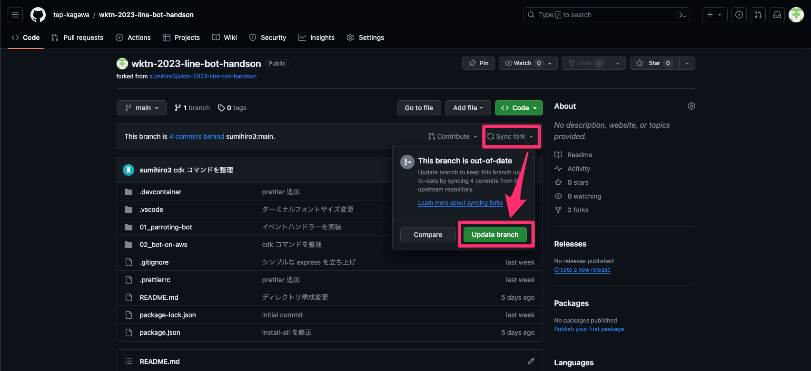
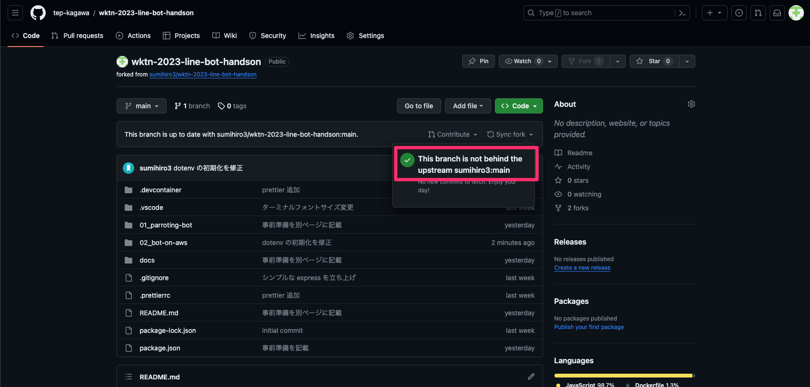
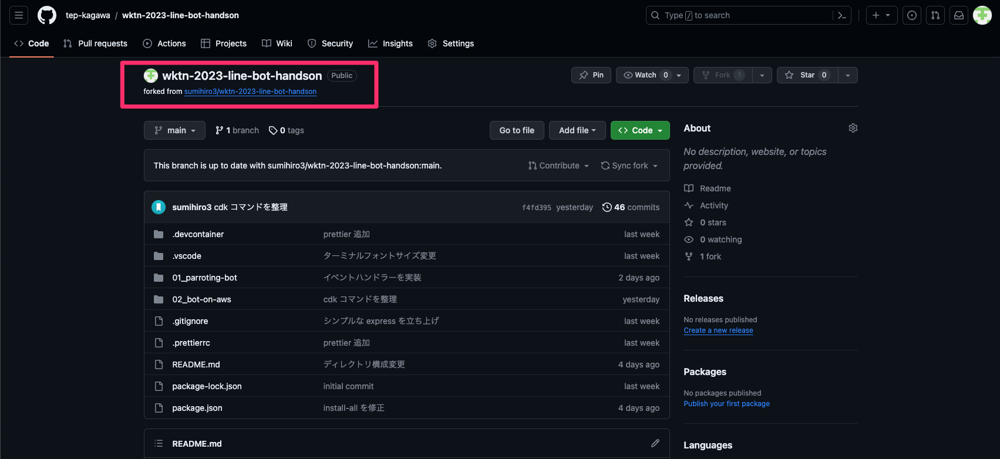
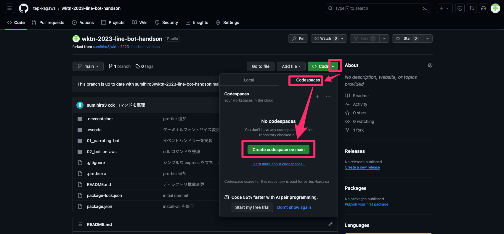
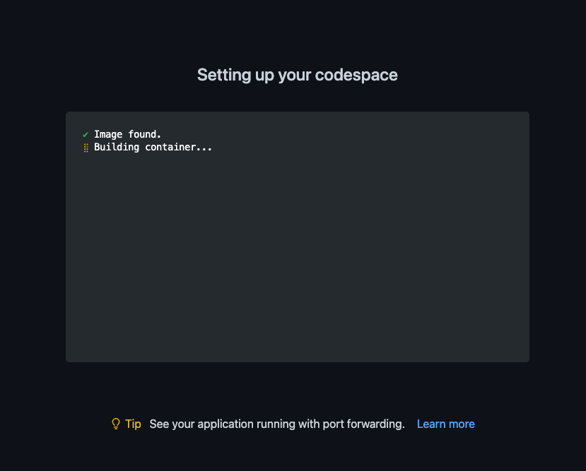

# wktn-2023-line-bot-handson

## 1. 事前準備

ハンズオン参加の前に下記ページに沿ってアカウント等の準備を実施しておいてください。

[事前準備](docs/ADVANCE_PREPARATION.md)

## 2. 今回のハンズオンで作成する LINE Bot

### 1. オウム返し Bot

最初に、ユーザーが送信したテキストメッセージをそのまま返す Bot を作成します。簡単に Bot アプリケーションを動かしてみましょう

- GitHub codespaces 上で動作するものを作ります

### 2. ユーザーとの会話を記録する Bot

ユーザーが送ったメッセージをデータベースに記録する Bot を作成します。
テキストメッセージと画像メッセージに対応し、画像はオンラインストレージに格納します。

- AWS 上で動作する Bot を作ります
- ユーザーとの会話履歴を記録するので、生成 AI を使って会話記録を踏まえた Bot へ拡張できます

## 3. 開発環境準備

### 1. リポジトリの最新化

事前準備を案内してから、リポジトリに更新が入っているので、Fork したリポジトリを最新化します。

Web ブラウザーで、事前準備で自分のアカウントにフォークしたリポジトリを開きます。

リポジトリページの `Sync fork` メニュを開き、`Update branch` を選択する。

最新化が完了すれば `This branch is not behind the upstream sumihiro3:main` と表示される。

なお、 `Update branch` が表示されていない場合は最新の状態ですので、最新化は不要です。

### 2. Codespace の起動

事前準備でフォークしたリポジトリで Codespace を起動します。

フォーク元から起動すると、今後のハッカソン向けに拡張した内容をコミットできなくなるので気をつけてください。

GitHub にログインした状態で、`Code` メニューで `Codespaces` タブを開き、`Create codespace on main` を選択する。

### 3. Codespace のビルド

起動が開始されると Codespace の設定が実行されます。

Codespace に設定する内容は [設定ファイル](.devcontainer/devcontainer.json) と [Dockerfile](.devcontainer/Dockerfile) に記載しています。
VS Code で利用する拡張機能や環境構築のスクリプトなどを設定できるので、興味がある方はご覧ください。

今回は主に下記の設定を行っています。

- VS Code で利用する拡張機能のインストール
    - インデントを見やすくする拡張機能
        - indent-rainbow
    - コードフォーマットを行う拡張機能
        - Prettier - Code formatter
- AWS CLI, AWS CDK のインストール
- Bot アプリケーションに必要な各種パッケージのインストール

## オウム返しBot

[オウム返しBotのハンズオンへ](./01_parroting-bot/README.md)

## Bot を AWS で稼働させる

[`Bot を AWS で稼働させる` のハンズオンへ](./02_bot-on-aws/README.md)
