# 事前準備

## 1. GitHub アカウントの作成

GitHub Codespaces を利用して開発環境を構築しますので、GitHub アカウントをお持ちでない方はアカウントを作成しておいてください。

### 参考

- [新しい GitHub アカウントへのサインアップ](https://docs.github.com/ja/get-started/signing-up-for-github/signing-up-for-a-new-github-account)
- [1分もかからない！5ステップでGitHubアカウント作成](https://reffect.co.jp/html/create_github_account_first_time/)

## 2. リポジトリのフォーク

こちらで準備したリポジトリを、自分のアカウントへコピー（フォーク）してハンズオンを行います。

### 2-1. ハンズオンで使うリポジトリページを開く

GitHub にログイン後、Web ブラウザー（Google Chrome 推奨）で下記 URL を開いてください。

- [wktn-2023-line-bot-handson](https://github.com/sumihiro3/wktn-2023-line-bot-handson)

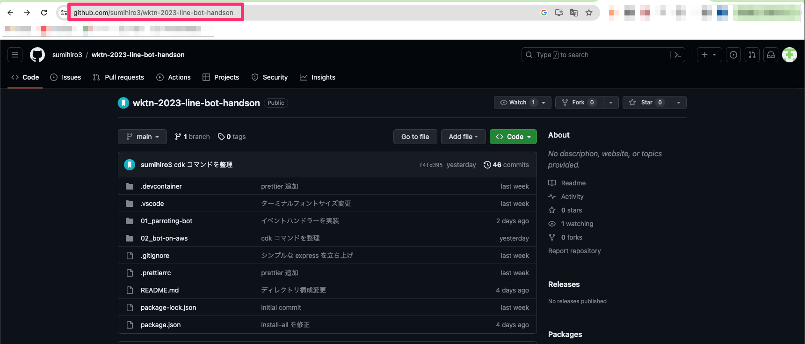

### 2-2. リポジトリを自分のアカウントにフォークする

今後のハッカソン開発向けにプログラムを変更できるよう、リポジトリを自分のアカウントにフォーク（コピー）しておきます。

`Fork` メニューを開いて `Create a new fork` を選択する

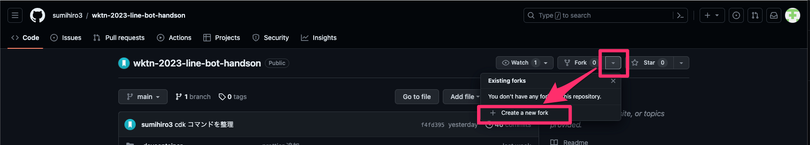

`wktn-2023-line-bot-handson` is available` を確認して `Create Fork` を選択する

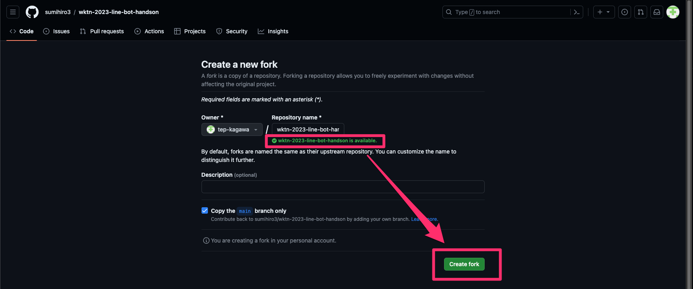

自分のアカウントにリポジトリがフォークされていることを確認する


## 3. AWS アカウントの準備

本イベント用に展開されている AWS アカウントへログインできるユーザーで、AWS Console へログインしてください。

### 3-1. AWS 環境構築等で利用する IAM ユーザーの作成

LINE Bot を AWS 環境にデプロイする際に利用する IAM ユーザーを作成します。

この作業はチームで1つのユーザーを作成しますので、各チームの代表の方のみ実施してください。

#### 3-1-1. IAM 画面への遷移

AWS コンソールの左上にある検索ボックスへ `iam` と入力し、IAM 画面へ遷移する。

#### 3-1-2. ユーザーグループの作成

権限を整理するためにユーザーグループを作成します。

画面左のメニュから `ユーザーグループ` を選択する。

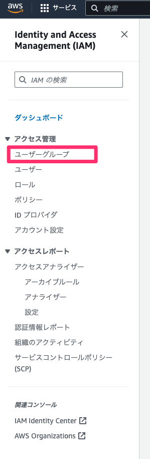

ユーザーグループ名に `nit-wktn-cdk-group` を入力する。

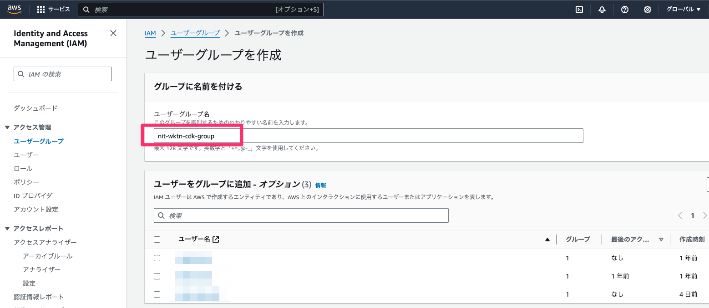

許可ポリシーの `AdministratorAccess` にチェックを入れて、`グループを作成` を選択する。
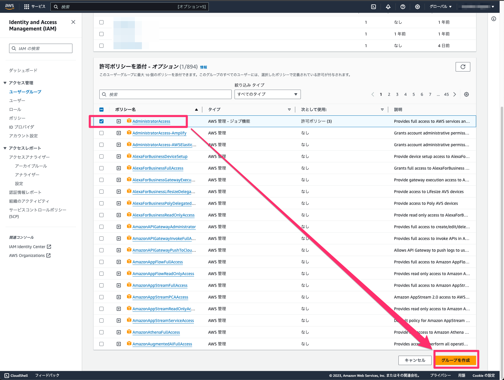

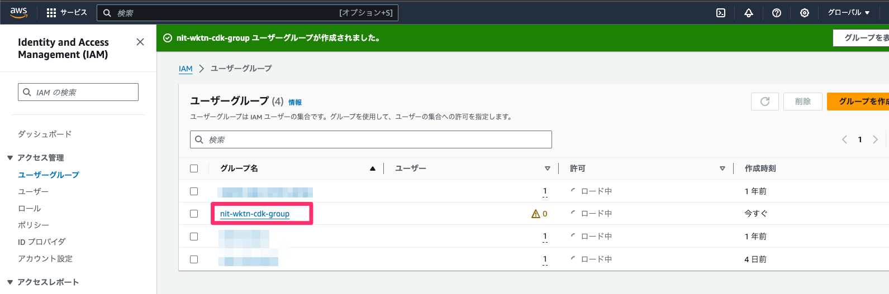

#### 3-1-3. ユーザーの作成

実行用のユーザーを作成します。

画面左のメニュから `ユーザー` を選択する。

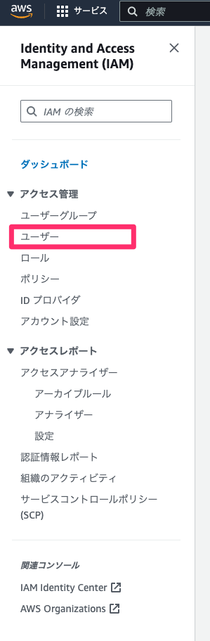

ユーザー名 `nit-wktn-cdk-user` を入力し、`次へ` を選択する。

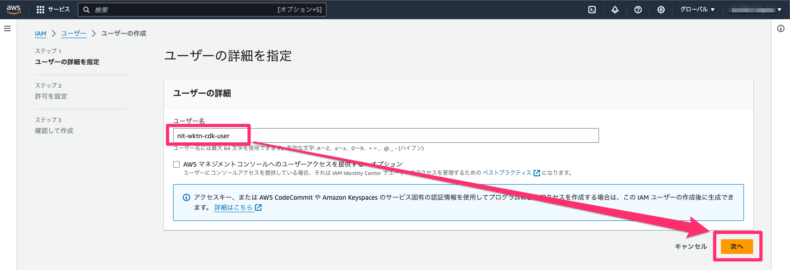

ユーザーが属するグループに先ほど作成したグループ `nit-wktn-cdk-group` を選択する。

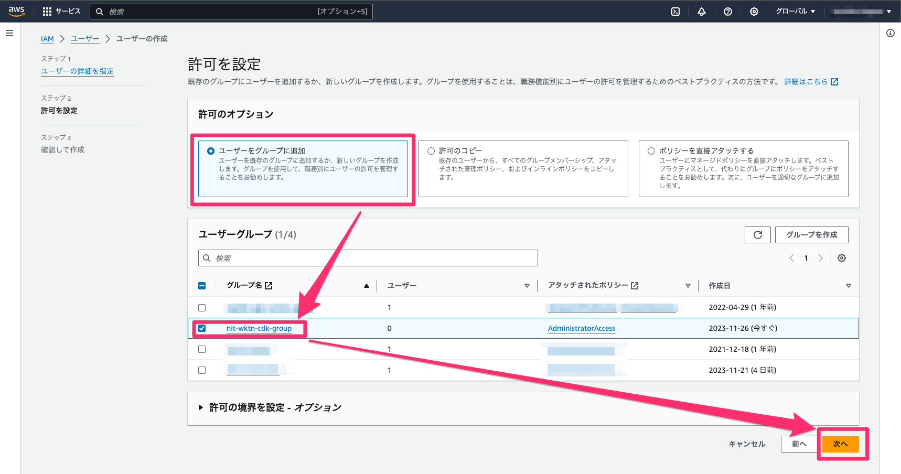

AWS CLI, AWS CDK を実行するためにアクセスキーを作成します。

作成したユーザーを選択し、`セキュリティ認証情報` タブから `アクセスキーを作成` を選択する。
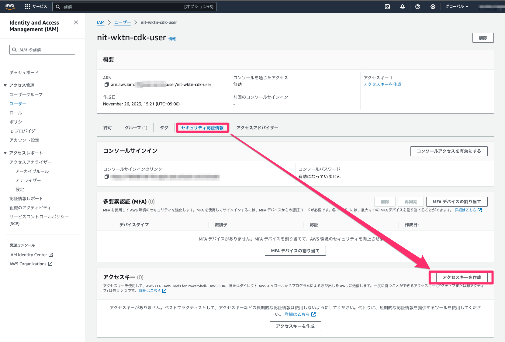

ユースケース `コマンドラインインターフェイス (CLI)` を選択し、確認のチェックボックスをオンにして、`次へ` を選択する。
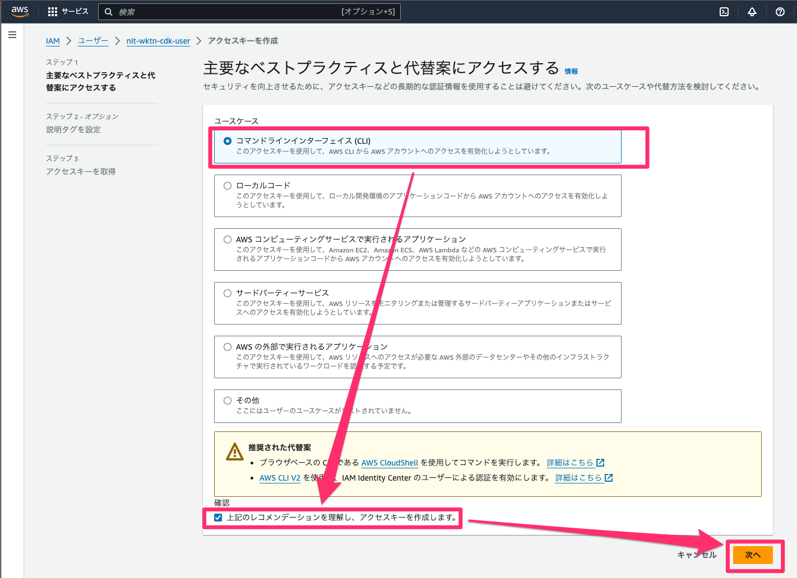

`アクセスキーを作成` を選択する。

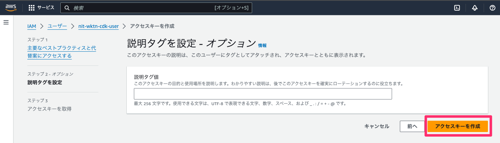

アクセスキーの CSV ファイルをダウンロードする。

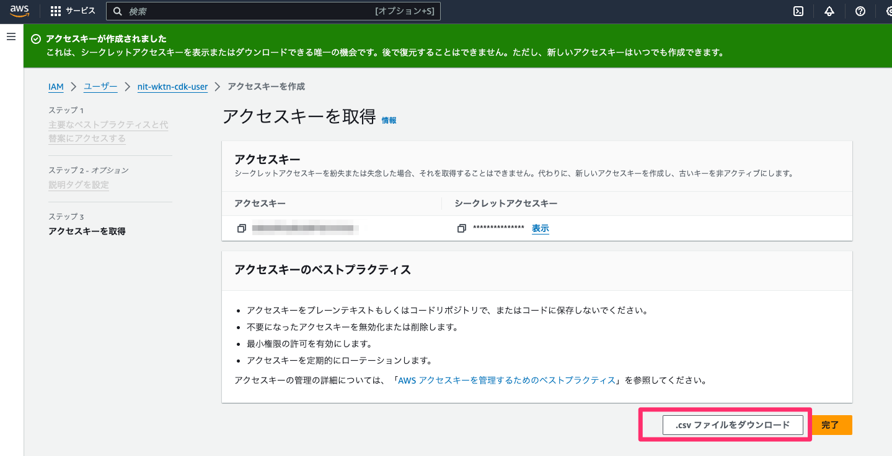

ダウンロードした CSV ファイルは下記のような内容となっています。
チームでハンズオンに参加される方に CSV ファイルを共有しておいてください。

```csv
Access key ID,Secret access key
XXXXXXXXXX, YYYYY1234567890ZZZZZZZ
```

## 4. LINE Bot の設定準備

[LINE Bot の設定準備](PREPARE_LINE_BOT.md) に沿って、LINE Developers への登録と、LINE Bot の設定準備を行ってください。
