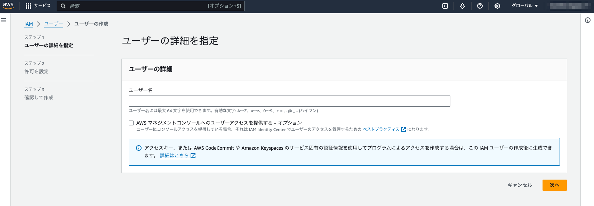

# 事前準備

## 1. GitHub アカウントの作成

GitHub Codespaces を利用して開発環境を構築しますので、GitHub アカウントをお持ちでない方はアカウントを作成しておいてください。

### 参考

- [新しい GitHub アカウントへのサインアップ](https://docs.github.com/ja/get-started/signing-up-for-github/signing-up-for-a-new-github-account)
- [1分もかからない！5ステップでGitHubアカウント作成](https://reffect.co.jp/html/create_github_account_first_time/)

## 2. リポジトリのフォーク

こちらで準備したリポジトリを、自分のアカウントへコピー（フォーク）してハンズオンを行います。

### 2-1. ハンズオンで使うリポジトリページを開く

GitHub にログイン後、Web ブラウザー（Google Chrome 推奨）で下記 URL を開いてください。

- [wktn-2023-line-bot-handson](https://github.com/sumihiro3/wktn-2023-line-bot-handson)

### 2-2. リポジトリを自分のアカウントにフォークする

今後のハッカソン開発向けにプログラムを変更できるよう、リポジトリを自分のアカウントにフォーク（コピー）しておきます。

`Fork` メニューを開いて `Create a new fork` を選択する

`wktn-2023-line-bot-handson` is available` を確認して `Create Fork` を選択する

自分のアカウントにリポジトリがフォークされていることを確認する

## 3. AWS アカウントの準備

本イベント用に展開されている AWS アカウントへログインできるユーザーで、AWS Console へログインできることを確認しておいてください。

また、IAM で `AdministratorAccess` 権限を持つユーザーを作成するので、IAM のユーザー作成画面にアクセスできることも確認しておいてください。

[ユーザー作成画面](https://us-east-1.console.aws.amazon.com/iam/home?region=ap-northeast-1#/users/create)

## 4. LINE Bot の設定準備

[LINE Bot の設定準備](PREPARE_LINE_BOT.md) に沿って、LINE Developers への登録と、LINE Bot の設定準備を行ってください。
