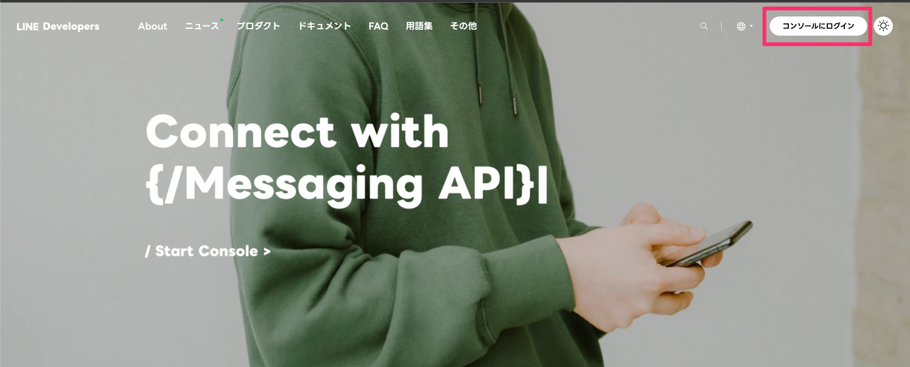
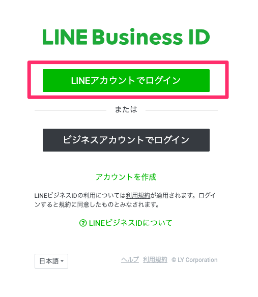
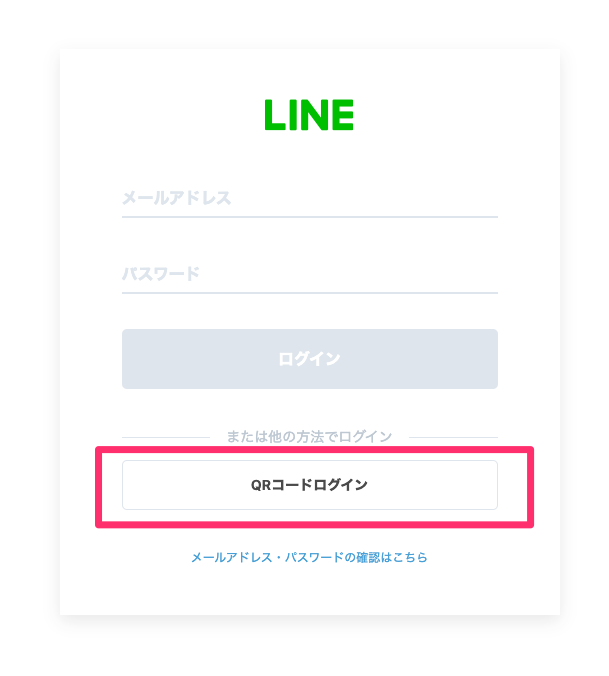
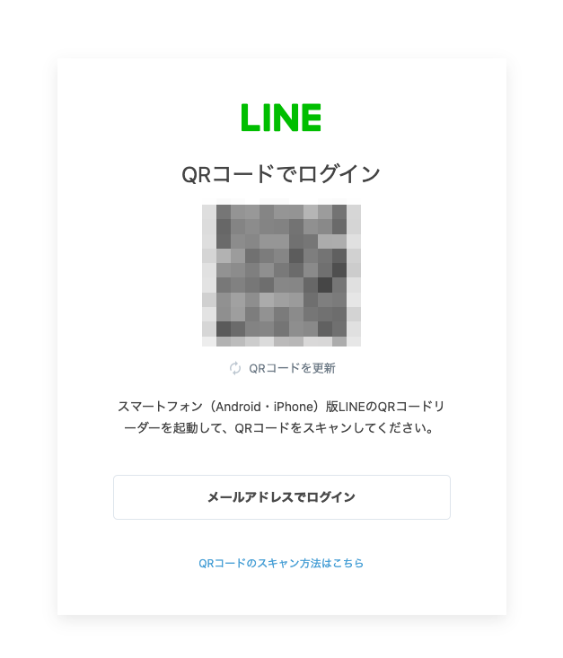
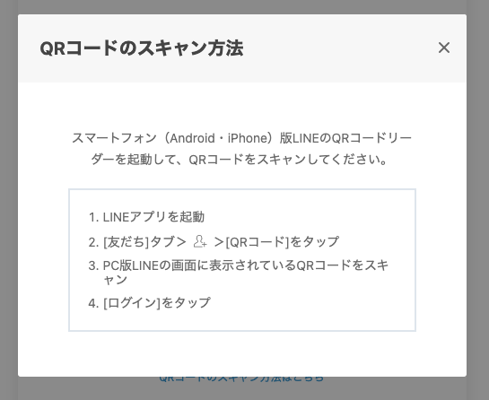
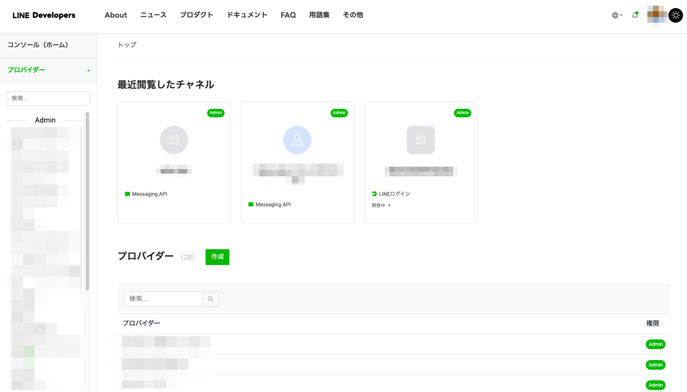
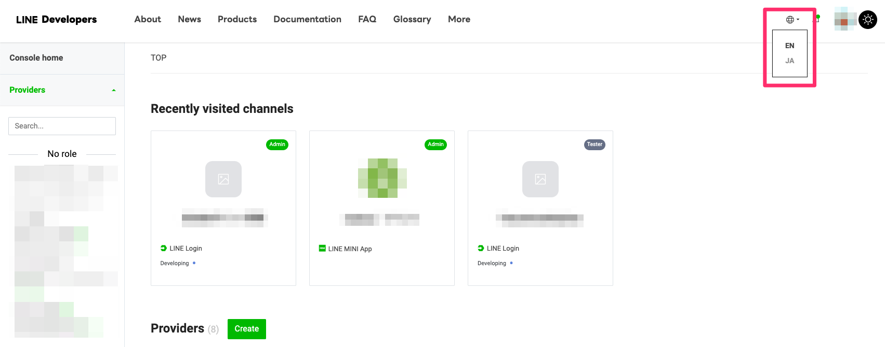
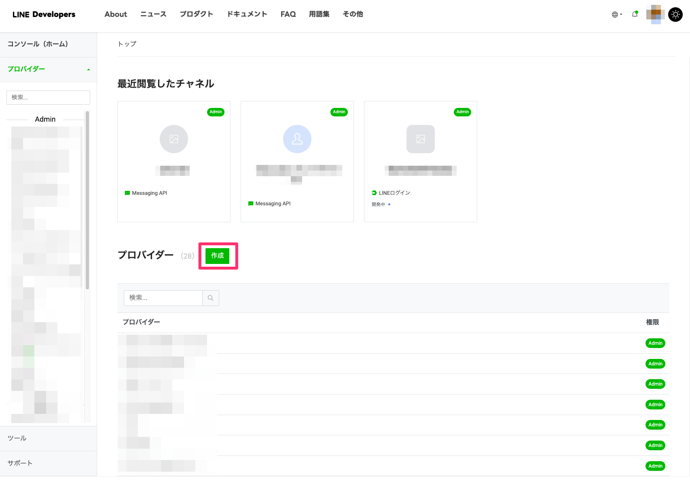
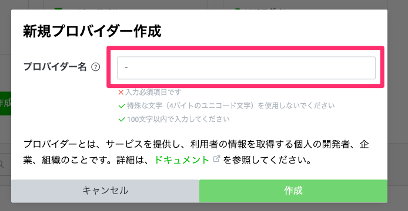

# LINE Bot の設定準備

## 1. LINE Developers へのログイン

LINE Bot などを作るためには、LINE 社が提供している開発者向けコンソール（LINE Developers）を利用します。まずは、LINE Developers にログインしてみましょう。

Web ブラウザーで [LINE Developers](https://developers.line.biz/ja/) にアクセスし、右上の `コンソールにログイン` を選択してください。

`LINEアカウントでログイン` を選択

`QRコードログイン` を選択

表示されたQRコードを LINE アプリでスキャン

詳しいスキャン方法は下記を参照

確認コードの入力を求められたら、Web ブラウザーに表示されている確認コードを入力してください。

下記のような画面が表示されればログイン成功です。

英語表記になっている場合、日本語に切り替えておいてください。

## 2. プロバイダーの作成

LINE Bot を作成するには、**プロバイダー** と **チャネル** の登録が必要です。

まずは、チャネルをグルーピングするプロバイダーを作成します。

プロバイダー欄の `作成` を選択

プロバイダー名を入力して、`作成` を選択

例：ワッカソンハンズオン

